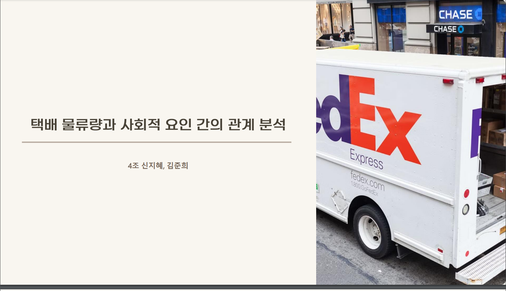
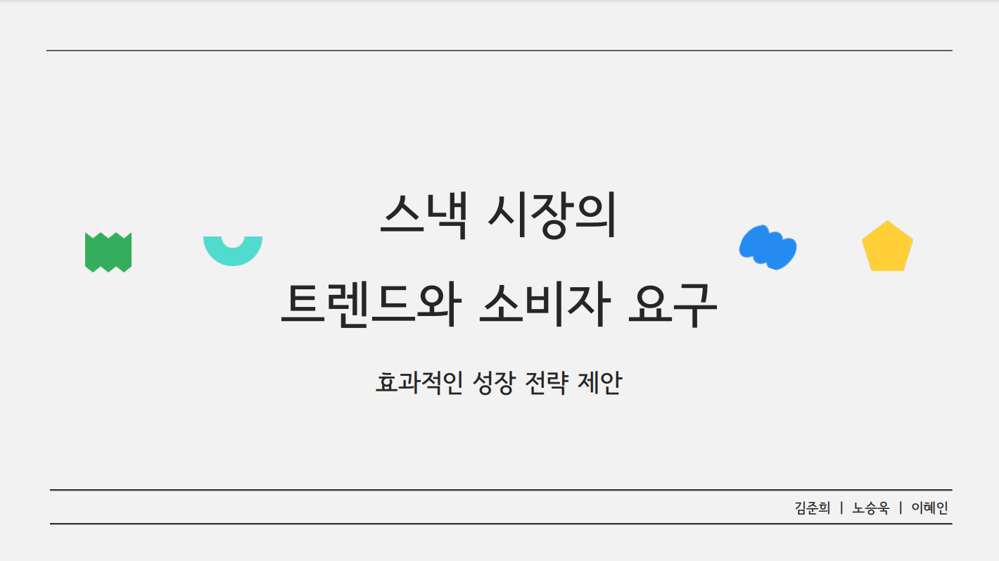

# Portfolio Projects

|  |  |
|:---------------------------------------:|:---------------------------------------:|
| **Project 1**  택배 물류량과 사회적 요인 간의 관계 분석 | **Project 2** 스낵시장의 트랜드와 소비자 요구 |

|  |
|:---------------------------------------:|
| **Project 3** Short description for project 3 |

## Additional Resources

Click the thumbnail above to watch the video on YouTube: **"Title of the Video"**.

## Certifications

